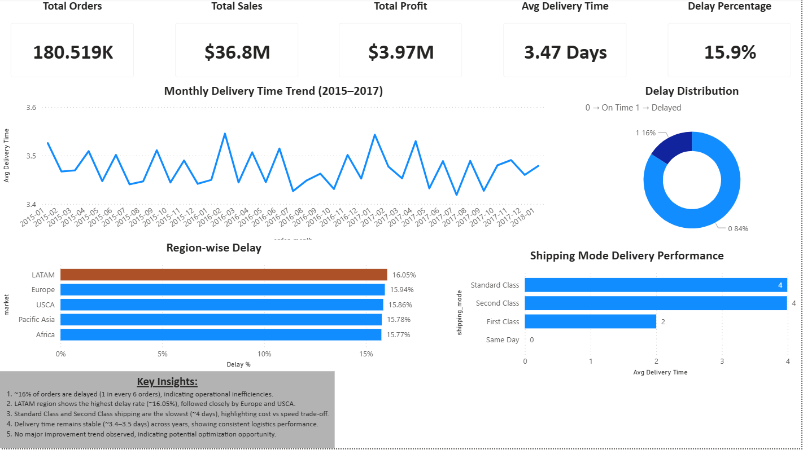

# 📦 Supply Chain Analytics Dashboard

## 📊 Overview
Analyzed 180K+ orders to identify delivery inefficiencies, regional delays, and shipping performance.

## 🛠 Tools
SQL | Python | Power BI

## 🔍 Key Insights
- ~16% orders delayed (1 in 6)
- LATAM has highest delay (~16.05%)
- Standard & Second Class are slowest (~4 days)
- Delivery time stable (~3.4–3.5 days)

## 📈 Dashboard

## 📁 Files
- sql/analysis_queries.sql
- python/data_cleaning.ipynb
- powerbi/supply_chain_dashboard.pbix

## 🚀 Outcome
Identified consistent delays and optimization opportunities in logistics.
